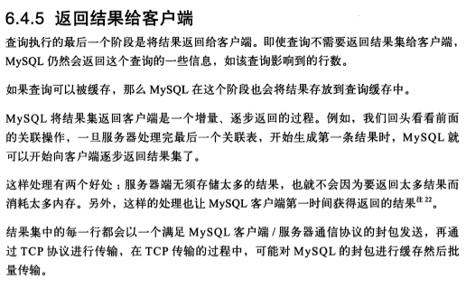

# reactive mysql

Reactive Mysql Example.

通过Reactive驱动访问Mysql数据库的示例程序库

## Contributing

[How to contribute](../CONTRIBUTING.md) 

## 部署数据库实例

1. 在`localhost`启动相应的数据库实例，并创建相应的数据表
      
    请查看 `src/main/resourcest/sql/rxdb.sql`
    
2. 在`configuration`配置类中设置数据库访问连接串，使程序能够连接到数据库实例
    
    请修改 `src/main/java/com.reactive.rxmysql.MysqlConfiguration`
    
## 启动应用程序

1. 通过`SpringBoot`启动应用程序
2. 通过`http`访问应用程序接口进行调试

1. 通过`test`单元测试进行调试

## 技术原理

### Mysql数据传输

mysql数据传输模式采用半双工模式，即请求发出后不可再次请求，直到响应接收完成

    MySQL客户端和服务器之间的通信协议是“半双工”的，无法将一个消息切成小块独立来发送，没法进行流量控制，一旦一端开始发生消息，另一端要接收完整个消息才能响应它
    
mysql服务端推送采用流式传输模式，即所有数据经查询引擎查询完毕后，将会每生成一行结果`result`，就通过网络传输一行

通过wireshark抓包时发现，每行数据占用一个完整的应用层协议包，但TCP可能合并多个应用层协议包来分块传输

每个mysql应用层协议包结束时应有一个EOF/FIN，用于通知该行已完毕；

在所有行传输完成后，将有一个EOF数据包传递，JDBC等BIO驱动接收到该EOF包，将会把之前所有缓存的数据全部返回给应用程序

    
来源: [高性能MySQL](https://github.com/caijc00/programmer_bookshelf_cn/blob/master/%E6%95%B0%E6%8D%AE%E5%BA%93/%E9%AB%98%E6%80%A7%E8%83%BDMySQL%20%E7%AC%AC3%E7%89%88%20%E4%B8%AD%E6%96%87%20.pdf)

### NIO缓冲模式

`r2dbc-mysql`驱动使用了NIO，鉴于NIO的水位触发/边缘触发模式，数据无需在内存中缓存到全部接收完成（JDBC需要缓存所有数据到内存中直到接收完成）

    严格来说，驱动程序不会阻塞任何线程。
    
    可能有两个EOF：元数据EOF和行数据EOF。
    
    在大/慢查询中，驱动程序将在准备好元数据（接收到的元数据EOF）并接收第一行数据时立即发出第一行。
    当然，如果元数据后没有行数据，它将仅发出一个完整的信号。
    
    在示例中添加更多其他信息：
    
    * 大查询将返回10行。
    * 发送该语句后，服务器将在0.8秒后推送元数据。
    * 服务器将在推送元数据后0.2秒推送第一行数据。驱动程序将立即将该行数据和元数据发送到`map`功能。
    * 服务器将在推送前一行数据后1秒钟推送每个后续行数据。随后的每个行数据接收一个，驱动程序立即发出一个。
    
    然后，答案是“是的，R2DBC MySQL从1秒到10秒持续消耗接收到的Mysql数据，而不是缓冲到内存中直到完成”。

Issue: [Whether R2DBC will wait for the EOF pushed by the MYSQL server?](https://github.com/mirromutth/r2dbc-mysql/issues/166)